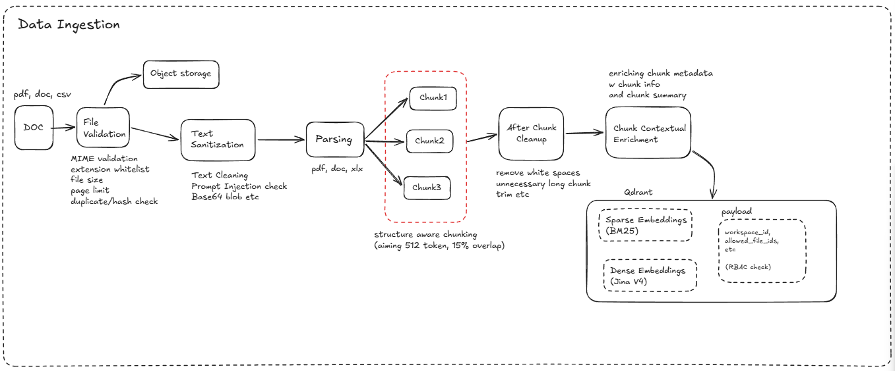
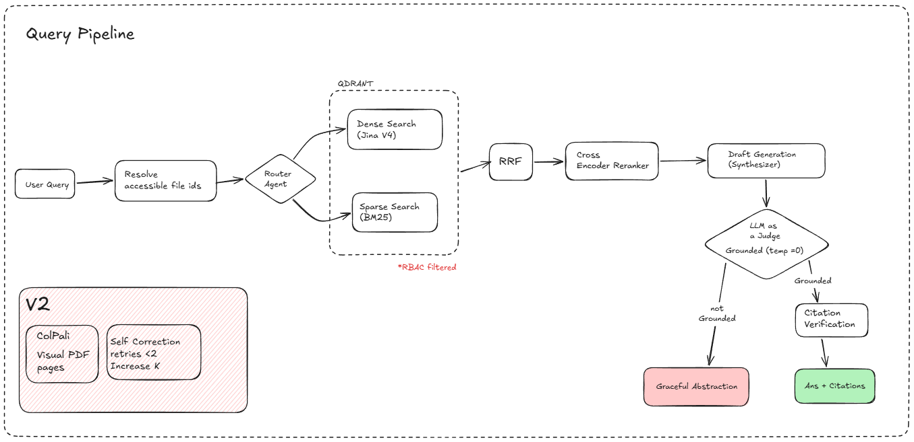

# InquireAI

InquireAI is an enterprise RAG knowledge assistant for asking grounded questions over internal documents. It combines structure-aware document ingestion, hybrid retrieval, permission-aware context, and citation-backed answers in one workflow.

> Project status: active development. The architecture and intended production workflow are documented here; some platform capabilities are still being built.

## Demo

**Demo video:** [Watch the InquireAI demo](docs/media/demo-video.mp4)

## Features

- Upload PDF, DOCX, XLSX, Markdown, and supported code files.
- Parse documents with structure-aware extraction and chunking.
- Combine sparse BM25 retrieval with dense vector search and reciprocal-rank fusion.
- Preserve document structure and attach workspace, role, and file metadata to chunks.
- Generate grounded answers with structured citations and citation validation.
- Return a graceful abstention when the evidence is not strong enough.
- Enforce access filtering during retrieval rather than after answer generation.
- Provide a FastAPI API and a Streamlit interface for local experimentation.
- Instrument the service with Logfire for application and system-metric observability.

## Architecture

### Data ingestion architecture




The ingestion path validates an upload, parses it with Docling, cleans and enriches the extracted content, creates structure-aware chunks, generates embeddings, and stores the chunks with access metadata for retrieval.

### Query architecture



The query path validates the request, applies workspace and role filters, retrieves relevant chunks, reranks and synthesizes the context, validates citations, and calculates confidence before returning an answer or abstention.

### Technology overview

| Area | Technology |
| --- | --- |
| API | FastAPI + Uvicorn |
| Orchestration | LangGraph |
| Document parsing | Docling |
| Embeddings | Hugging Face sentence-transformers |
| Vector retrieval | Qdrant |
| Sparse retrieval | Qdrant / BM25 direction |
| Generation | Groq through LangChain |
| Guardrails | Prompt Guard, Presidio, and Sementic Similarity |
| Observability | Logfire |

## Repository layout

```text
InquireAI/
	app/
		api/          FastAPI routes for health, uploads, and chat
		graph/        LangGraph state, routing, and processing nodes
		ingestion/    Parsing, cleaning, chunking, enrichment, and embedding
		retrieval/    Hybrid retrieval, reranking, confidence, and synthesis
		guardrails/   Prompt and PII safety checks
	tests/          Ingestion and parsing tests
	main.py         FastAPI application entry point
	streamlit_app.py  Local interactive UI
```

## Local development

The AI service requires Python 3.13 or newer and uses `uv` for dependency management.

```powershell
cd services/ai-service
uv sync
uv run uvicorn main:app --reload
```

The API is then available at `http://localhost:8000`.

Useful endpoints:

- `GET /health` - service health check
- `GET /version` - service version
- `POST /files` - upload and ingest a document
- `POST /api/chat/` - query the knowledge assistant

To run the Streamlit interface:

```powershell
cd services/ai-service
uv run streamlit run streamlit_app.py
```

## Tests

```powershell
cd services/ai-service
uv run pytest
```

## Documentation

- [Architecture document](Architecture%20Doc.md) - detailed system decisions, pipelines, guardrails, and deployment profiles.
- [AI service README](services/ai-service/README.md) - service-specific setup and development notes.

## Roadmap

- Complete authentication, workspace management, and role-based access flows.
- Connect durable PostgreSQL, Qdrant, Redis, and S3-compatible storage adapters.
- Add GitHub read-only retrieval through MCP.
- Add full-profile visual PDF retrieval with ColPali and cross-encoder reranking.
- Add evaluation workflows and the production deployment configuration.
